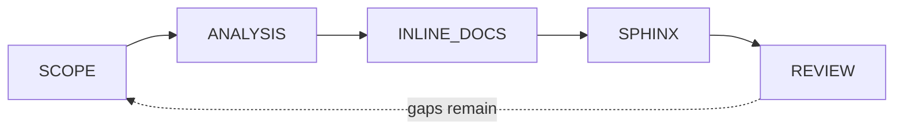

# Integrating the Workflow into the Documentation Agent

This document explains how the five-phase documentation workflow is embedded into the
existing **Documentation Agent** and executed automatically by the `doc_agent` pipeline.

## 1. Existing agent: capabilities and architecture

The agent is defined in [.github/agents/documentation.agent.md](../../.github/agents/documentation.agent.md).

- **Type:** a VS Code Copilot custom agent (natural-language instructions + YAML frontmatter).
- **Granted tools:** `read`, `edit`, `search`. Shell execution (`execute`) is intentionally
  **not** granted.
- **Mandate:** keep engineering docs in sync with code; report — never "fix" — code that
  disagrees with docs.

Because the agent cannot run shell commands, Sphinx generation (which needs a subprocess)
is delegated to a companion automation entry point, the `doc_agent` package. The agent
owns the reasoning/editing phases; the pipeline owns deterministic execution and tooling.

## 2. Phase → action mapping

| Workflow phase | Agent action | Pipeline state | Implementation |
|----------------|--------------|----------------|----------------|
| 1 · Scope identification | Pick the source package to document. | `Phase.SCOPE` | `pipeline._phase_scope` — globs `*.py`, applies excludes |
| 2 · File / logic analysis | Load code, find undocumented objects. | `Phase.ANALYSIS` | `docstrings.analyze_file` (`ast`-based gap report) |
| 3 · Inline documentation | Insert docstrings for each gap. | `Phase.INLINE_DOCS` | `docstrings.apply_docstrings` |
| 4 · Sphinx automation | Scaffold + build the docs site. | `Phase.SPHINX` | `sphinx_build.generate` (`sphinx-apidoc` + `sphinx-build`) |
| 5 · Review & maintenance | Verify no gaps remain; loop on drift. | `Phase.REVIEW` | re-run gap analysis, report remaining gaps |

## 3. Implementation: a state machine

The workflow is implemented as an ordered **state machine** in
[doc_agent/pipeline.py](../../doc_agent/pipeline.py). The driver iterates the phases in
order, records a `PhaseResult` per phase, and **stops early on a fatal failure**. Each
phase is invariant-guarded:

- **Phase 3 always runs before Phase 4** — docstrings are written to disk before Sphinx is
  invoked, so `sphinx.ext.autodoc` picks up the freshly generated docstrings.
- Phase 5 re-analyzes the files; if any gaps remain it reports a **warning** telling the
  operator to re-run (re-entering scope), matching the workflow's feedback loop.



## 4. Error handling and logging

- Every phase handler runs inside a `try/except` in the driver; an unexpected exception is
  converted into a `failed` `PhaseResult` instead of crashing the process.
- Status levels: **ok**, **warning** (non-fatal — e.g. Sphinx not installed, or residual
  gaps), **failed** (fatal — e.g. unparseable source, hard Sphinx build error). A `failed`
  status halts the pipeline.
- Logging is configured in [doc_agent/__main__.py](../../doc_agent/__main__.py) and writes
  to both stdout and `docs/sphinx/doc_agent_run.log`.
- A machine-readable summary of every run is written to `docs/sphinx/pipeline_run.json`.

## 5. Running it

```bash
python -m doc_agent --path sample_project --docs-dir docs/sphinx --project "Calculator"
```

Flags:

- `--no-sphinx` — run phases 1–3 and 5 only (docstrings without a build).
- `--verbose` — debug-level logging.

Prerequisite for phase 4: `pip install sphinx`. If Sphinx is absent, phase 4 degrades to a
**warning** and the rest of the workflow still completes.

## 6. Demonstrated test run

Run against [sample_project/](../../sample_project/) (a deliberately undocumented
`calculator` package):

```
=> scope_identification: ok — Identified 2 source file(s) in scope.
=> file_logic_analysis:  ok — Found 9 missing docstring(s); 0 file(s) unparseable.
=> inline_documentation: ok — Wrote 9 docstring(s) before Sphinx generation.
=> sphinx_generation:    ok — Documentation generated at docs/sphinx/_build/html
=> review_maintenance:   ok — All targeted objects are documented.
run complete: ok=True docstrings_written=9 docs_built=True
```

This satisfies the acceptance criteria:

- **Follows the documented workflow** — phases 1→5 execute in order (see `pipeline_run.json`).
- **Docstrings before Sphinx** — phase 3 wrote 9 docstrings before phase 4 ran `sphinx-build`.
- **Demonstrable** — rendered HTML is produced under `docs/sphinx/_build/html/`
  (`index.html`, `calculator.html`, `modules.html`, …).

To reproduce from a clean state, revert the docstrings inserted into
`sample_project/calculator/operations.py` (e.g. `git checkout`) and re-run the command.
