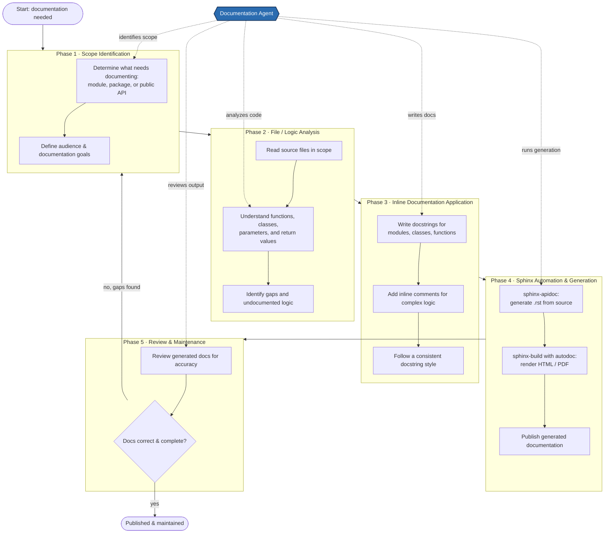

# Documentation Workflow

A clear, end-to-end view of the documentation process, from identifying what needs to be
documented through generating output with Sphinx and keeping it maintained. The diagram
shows the five workflow phases, their sequence and dependencies, and the points where the
documentation agent interacts with the workflow.

## Workflow diagram



> The blue **Documentation Agent** node uses dotted edges to show where it participates in
> each phase of the workflow.

## Phase notes

| # | Phase | Purpose | Documentation agent involvement | Depends on |
|---|-------|---------|---------------------------------|------------|
| 1 | Scope Identification | Decide what code needs documentation and define the audience and goals. | Identifies the scope. | A documentation request. |
| 2 | File / Logic Analysis | Read the in-scope source, understand its behavior, and find undocumented logic. | Analyzes the code. | Scope from Phase 1. |
| 3 | Inline Documentation Application | Add docstrings and inline comments in a consistent style. | Writes the documentation. | Analysis from Phase 2. |
| 4 | Sphinx Automation & Generation | Generate `.rst` stubs and build rendered HTML/PDF from docstrings, then publish. | Runs the generation. | Inline docs from Phase 3. |
| 5 | Review & Maintenance | Verify accuracy and completeness; loop back when gaps are found. | Reviews the output. | Generated docs from Phase 4. |

## Sequence & dependency summary

- **Linear flow:** Phase 1 → 2 → 3 → 4 → 5, with each phase depending on the output of the one before it.
- **Feedback loop:** if review finds the documentation inaccurate or incomplete, the workflow returns to scope identification for another pass.

## Rendering to PNG / PDF

The Mermaid block above is the editable source. To export a static image:

```bash
# PNG
npx @mermaid-js/mermaid-cli -i docs/documentation-agent/workflow-generic.md -o docs/documentation-agent/workflow-generic.png

# PDF
npx @mermaid-js/mermaid-cli -i docs/documentation-agent/workflow-generic.md -o docs/documentation-agent/workflow-generic.pdf
```

In VS Code, the Markdown preview renders the diagram directly, and the Mermaid
extension offers a right-click **Export** to PNG/SVG.
