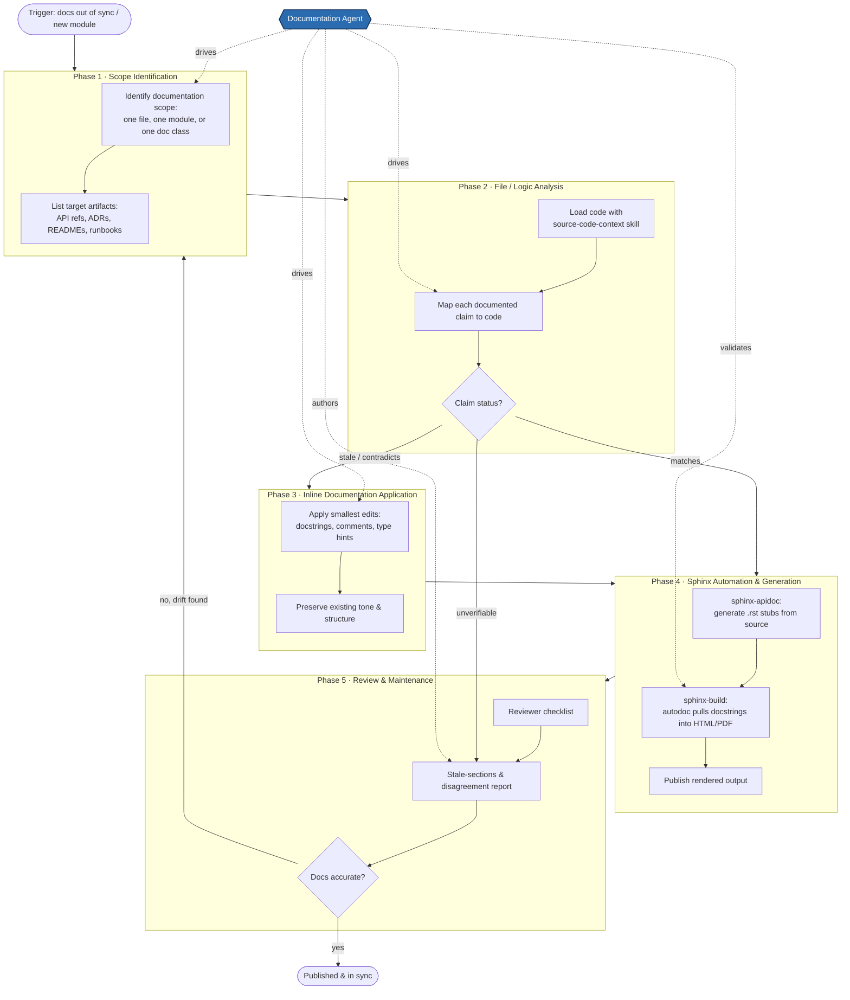

# Documentation Workflow

End-to-end workflow for producing and maintaining engineering documentation, from
scope identification through Sphinx generation and ongoing maintenance. The diagram
highlights every point where the **Documentation Agent** interacts with the process.

## Workflow diagram



> The blue **Documentation Agent** node uses dotted edges to mark each phase it acts on.
> It authors and edits documentation only — it never changes source code, tests, or
> configuration (code/doc disagreements are reported, not "fixed").

## Phase notes

| # | Phase | Purpose | Documentation Agent role | Key dependency |
|---|-------|---------|--------------------------|----------------|
| 1 | Scope Identification | Bound the work to one file, module, or document class and enumerate target artifacts. | Selects scope and target artifacts. | A trigger (drift, new/changed code). |
| 2 | File / Logic Analysis | Load the relevant code and map every documented claim to its source; classify as matches / stale / contradicts / unverifiable. | Runs analysis via the `source-code-context` skill and categorizes claims. | Scope from Phase 1. |
| 3 | Inline Documentation Application | Apply the smallest edits — docstrings, comments, type hints — while preserving tone and structure. | Authors the inline documentation edits. | Stale/contradicting claims from Phase 2. |
| 4 | Sphinx Automation & Generation | `sphinx-apidoc` scaffolds `.rst`; `sphinx-build` + autodoc render docstrings into HTML/PDF; publish. | Validates that autodoc output reflects the edits. | Inline docs from Phase 3 (or already-matching claims). |
| 5 | Review & Maintenance | Reviewer checklist, stale-sections report, and drift detection that loops back to Phase 1. | Authors the reviewer checklist and stale-sections report. | Generated docs from Phase 4. |

## Sequence & dependency summary

- **Linear spine:** Phase 1 → 2 → 3 → 4 → 5, then a maintenance loop back to Phase 1 when drift is detected.
- **Branch in Phase 2:** claims that already *match* skip inline editing and go straight to Sphinx generation; *stale/contradicting* claims route to Phase 3; *unverifiable* claims are logged in the Phase 5 report rather than restated.
- **Feedback loop:** if review finds the docs inaccurate, the workflow re-enters at scope identification.

## Rendering to PNG / PDF

The Mermaid block above is the editable source. To export a static image:

```bash
# PNG
npx @mermaid-js/mermaid-cli -i docs/documentation-workflow.md -o docs/documentation-workflow.png

# PDF
npx @mermaid-js/mermaid-cli -i docs/documentation-workflow.md -o docs/documentation-workflow.pdf
```

In VS Code, the Markdown preview renders the diagram directly, and the Mermaid
extension offers a right-click **Export** to PNG/SVG.
